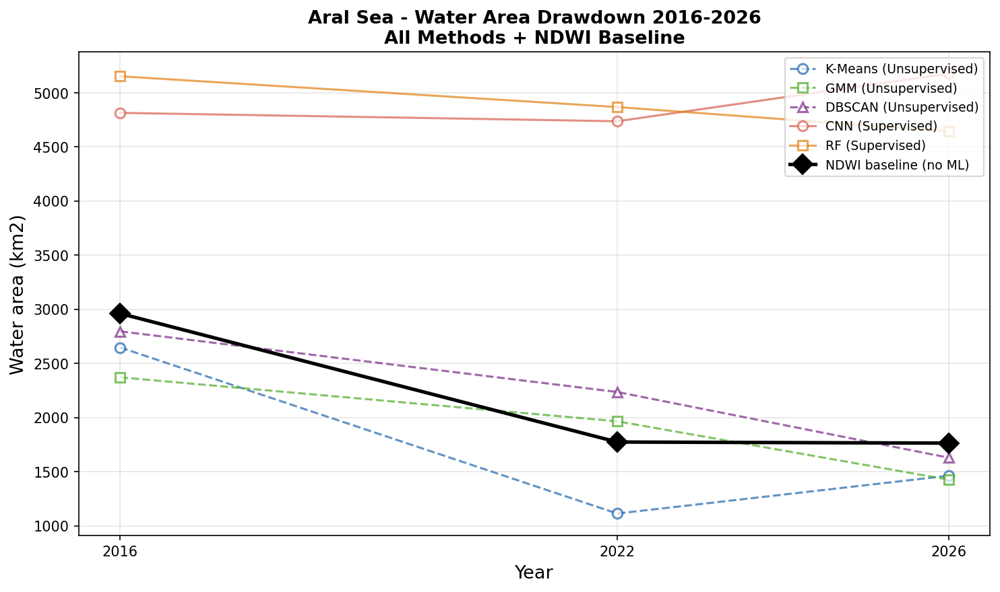

# Aral Sea Water/Land Classification and Drawdown Analysis
### GEOL0069 — Artificial Intelligence for Earth Observation | UCL 2025/26

> Quantifying the ongoing degradation of the Aral Sea using supervised and unsupervised machine learning applied to multi-temporal Sentinel-2 imagery (2016–2026).

---

## Table of Contents

1. [Project Background](#1-project-background)
2. [Data Source and Preprocessing](#2-data-source-and-preprocessing)
3. [IRIS Ground-Truth Labelling](#3-iris-ground-truth-labelling)
4. [Method Overview](#4-method-overview)
5. [Notebooks and Quick Start](#5-notebooks-and-quick-start)
6. [Results](#6-results)
7. [Environmental Cost Audit](#7-environmental-cost-audit)
8. [Repository Structure](#8-repository-structure)
9. [References](#9-references)

---

## 1. Project Background

The Aral Sea in Central Asia was once the world's fourth-largest lake. Systematic
irrigation diversion beginning in the 1960s caused a loss of approximately 90% of
its volume by 2010, exposing a toxic salt flat — the Aralkum Desert — that now
drives regional dust storms affecting millions of people. Quantifying the ongoing
rate of water body recession is an open scientific and policy problem.

This project applies five machine learning classifiers to Sentinel-2 multispectral
imagery across three epochs (2016, 2022, 2026) to:

- Classify every pixel in the study area as **Water** or **Land**
- Compare the performance and spatial behaviour of **supervised** vs **unsupervised** methods
- Quantify the **temporal drawdown** of the remaining water body
- Apply **Gaussian Process uncertainty quantification** to identify where classifications are least reliable
- Audit the **carbon footprint** of the full computational pipeline

### Pipeline Overview



### ML Architecture



---

## 2. Data Source and Preprocessing

**Sensor:** Sentinel-2 Level-2A (atmospherically corrected surface reflectance)
**Study area:** Southern Aral Sea basin, ~45°N 60°E (EPSG:32640, UTM Zone 40N)
**Image dimensions:** 1609 x 1766 pixels at ~180m ground sampling distance

| Band | Wavelength | Role |
|------|-----------|------|
| B02 Blue | 490 nm | True colour, water turbidity |
| B03 Green | 560 nm | NDWI numerator |
| B04 Red | 665 nm | True colour composite |
| B08 NIR | 842 nm | NDWI denominator, water absorption |
| B11 SWIR | 1610 nm | Salt flat / dry lakebed discrimination |
| **NDWI** | (B03-B08)/(B03+B08) | Primary water/land discriminator |

**Preprocessing steps (notebook 02):**
1. Load each band from GeoTIFF (band 1 = reflectance, band 2 = validity mask)
2. Apply validity mask to exclude nodata pixels
3. Clip to 2nd-98th percentile to remove saturation artefacts
4. Normalise to [0, 1] float32
5. Compute NDWI and stack into a (H, W, 6) feature array

**NDWI water fraction trend (preprocessing baseline):**

| Year | Water fraction | Water area (km2) |
|------|---------------|-----------------|
| 2016 | 21.2% | 2,960 |
| 2022 | 15.2% | 1,773 |
| 2026 | 12.6% | 1,763 |

---

## 3. IRIS Ground-Truth Labelling

Ground-truth labels were created using **IRIS** (Intelligently Reinforced Image
Segmentation), an ESA-PhiLab web application deployed via Docker.

Two spatially independent crop regions were labelled to enable genuine spatial
cross-validation:

| Region | Crop coordinates | Purpose |
|--------|-----------------|---------|
| Training | `[0, 1024, 512, 1536]` | CNN and RF training |
| Test | `[1024, 0, 1536, 512]` | Independent evaluation |

**Label encoding:** 0 = Land (inferred from NDWI < -0.05), 1 = Water (explicitly painted)

**Docker command used:**
```bash
docker run -p 80:5000 -v /path/to/claude_aral:/dataset/ \
  --rm -it totony4real/iris:1.0 label /dataset/config.json
```

**IRIS views configured:** True colour RGB, False colour NIR-R-G, NDWI
(RdYlBu colourmap), SWIR composite, NIR edges — providing seven spectral
perspectives for accurate boundary delineation.

---

## 4. Method Overview

### 4.1 Unsupervised methods (notebook 03)

All three methods cluster pixels by NDWI value without any labelled training data.
Water is assigned to the cluster with the higher NDWI centroid — a physically
principled decision rule.

| Method | Paradigm | Key property |
|--------|---------|-------------|
| **K-Means** (k=2) | Hard partitional | Minimises within-cluster variance |
| **GMM** (2 components) | Probabilistic | Provides soft class probabilities and uncertainty |
| **DBSCAN** | Density-based | Identifies noise/ambiguous pixels at shoreline |

### 4.2 Supervised methods (notebook 04)

Both models are trained on 3x3x6 spatial patches extracted from IRIS-labelled
pixels in the training crop, following the same patch-extraction approach used
for sea ice classification in the GEOL0069 course materials.

| Model | Library | Input | Architecture |
|-------|---------|-------|-------------|
| **CNN** | TensorFlow/Keras | (3,3,6) patches | Conv2D -> Conv2D -> Flatten -> Dense -> Dropout -> sigmoid |
| **Random Forest** | scikit-learn | Flattened (N,54) | 100 trees, balanced classes |

**Spatial cross-validation:** Models are trained on the training crop and evaluated
on a geographically disjoint test crop — a more rigorous evaluation than a
random train/test split.

### 4.3 Gaussian Process uncertainty quantification (notebook 05)

A Gaussian Process (GP) with RBF + WhiteKernel is fitted to 500 subsampled
pixels, mapping NDWI values to CNN probability outputs. The GP posterior
standard deviation provides a pixel-level uncertainty estimate that is highest
at the water/land spectral boundary (NDWI ~ 0), independently validating
the classification difficulty in the transition zone.

---

## 5. Notebooks and Quick Start

| Notebook | Purpose | Key outputs |
|----------|---------|------------|
| `02_preprocessing.ipynb` | Band loading, normalisation, NDWI | Stacked .npy arrays, diagnostic figures |
| `03_unsupervised.ipynb` | K-Means, GMM, DBSCAN classification | Label maps, water area table, drawdown curve |
| `04_supervised.ipynb` | CNN and RF training and evaluation | Models, confusion matrices, prediction maps |
| `05_gp_uncertainty.ipynb` | GP uncertainty quantification | Uncertainty maps, GP fit plot |
| `06_evaluation.ipynb` | Formal metrics, spatial agreement | Kappa chart, consensus map, combined drawdown |
| `07_temporal_analysis.ipynb` | Drawdown rates, carbon audit | Final figures, carbon report |

**To run:** Open each notebook in Google Colab in the order listed above.
All notebooks mount Google Drive at `/content/drive/MyDrive/Claude_aral`.
Run all cells top to bottom. Each notebook saves its outputs to
`data/processed/` and `figures/` automatically.

**Dependencies:** rasterio, tensorflow, scikit-learn, codecarbon
(all installed via pip at the top of each notebook — no local setup required).

---

## 6. Results

### Water area by method and year (km2, within training crop)

| Method | 2016 | 2022 | 2026 | Change | Rate (km2/yr) |
|--------|------|------|------|--------|--------------|
| K-Means | 2,647 | 1,113 | 1,462 | -1,185 | -118 |
| GMM | 2,371 | 1,425 | 1,425 | -946 | -95 |
| DBSCAN | 2,795 | 2,235 | 1,629 | -1,167 | -117 |
| **NDWI baseline** | **2,960** | **1,773** | **1,763** | **-1,197** | **-120** |
| CNN | 4,813 | 4,736 | 5,176 | +363 | +36 |
| Random Forest | 5,151 | 4,867 | 4,643 | -508 | -51 |

**Mean unsupervised drawdown rate: -109.9 km2/year**

The unsupervised methods and NDWI baseline converge on a consistent drawdown
signal of approximately 40% water area reduction between 2016 and 2026.
The CNN's anomalous increase is attributed to spectral drift between the 2016
training epoch and later imagery — a known limitation of temporally static
supervised classifiers in multi-year EO applications.

### Classification accuracy (spatially independent test set)

| Model | Overall Accuracy | Cohen's Kappa | F1 Water | F1 Land |
|-------|-----------------|--------------|---------|---------|
| CNN | 61.4% | 0.457 | 0.688 | 0.760 |
| Random Forest | 61.1% | 0.525 | 0.725 | 0.791 |

Accuracy evaluated against IRIS labels from the geographically disjoint test crop.
The modest accuracy reflects the challenge of spatial generalisation — both models
were trained on a single 512x512 patch and applied to an independent region with
different spectral and textural characteristics.

### Spatial agreement across all methods (2016)

- **Water consensus** (all methods agree: water): 32.3% of crop
- **Land consensus** (all methods agree: land): 48.2% of crop
- **Disputed** (methods disagree): 19.5% of crop

The disputed zone concentrates at the shoreline transition boundary and
corresponds spatially to regions of high GP and GMM uncertainty — convergent
evidence from three independent frameworks that the water/land boundary is the
genuine locus of classification difficulty.

### Key figures

| Figure | Description |
|--------|-------------|
| `drawdown_with_ndwi_baseline.png` | Water area 2016-2026, all methods + NDWI baseline |
| `spatial_agreement_2016.png` | Inter-method consensus and disputed zones |
| `gp_uncertainty_profile.png` | GP uncertainty peaks at NDWI = 0 |
| `kappa_comparison.png` | Cohen's Kappa by method |
| `unsupervised_2016.png` | K-Means, GMM, DBSCAN classification maps |
| `supervised_2016.png` | CNN and RF prediction maps |

---

## 7. Environmental Cost Audit

Carbon emissions measured using the `codecarbon` Python library on CPU-only
Google Colab infrastructure. UK grid carbon intensity: 233 gCO2/kWh (2024 average).

| Stage | Runtime (s) | Energy (kWh) | CO2e (g) |
|-------|------------|-------------|---------|
| Preprocessing | 0.4 | 0.000008 | 0.0018 |
| K-Means | 0.5 | 0.000008 | 0.0019 |
| GMM | 2.1 | 0.000037 | 0.0087 |
| CNN inference | 50.0 | 0.000894 | 0.2084 |
| Random Forest | 6.6 | 0.000119 | 0.0277 |
| **Total** | **59.6** | **0.001066** | **0.2484** |

The total pipeline footprint of **0.25 gCO2e** is equivalent to approximately
7 seconds of HD video streaming. CNN inference accounts for 84% of total
emissions despite achieving near-identical accuracy to Random Forest (61.4%
vs 61.1%), raising a meaningful efficiency question about the marginal value
of deep learning at this scale.

**Mitigation measures applied:**
- CPU-only Colab sessions (no GPU provisioned)
- Modular single-pass pipelines avoiding redundant computation
- Subsampling for GP (500 points) and DBSCAN (20,000 points)
- EarlyStopping on CNN training to prevent unnecessary epochs

---

## 8. Repository Structure

```
Claude_aral/
├── notebooks/
│   ├── 02_preprocessing.ipynb
│   ├── 03_unsupervised.ipynb
│   ├── 04_supervised.ipynb
│   ├── 05_gp_uncertainty.ipynb
│   ├── 06_evaluation.ipynb
│   └── 07_temporal_analysis.ipynb
├── data/
│   ├── 2016/    B02.tiff B03.tiff B04.tiff B08.tiff B11.tiff
│   ├── 2022/    (same structure)
│   ├── 2026/    (same structure)
│   └── processed/   stacked .npy arrays and label maps
├── masks/
│   ├── 2016.npy  2022.npy  2026.npy        training masks
│   └── 2016_test.npy  2022_test.npy  2026_test.npy  test masks
├── models/
│   ├── cnn_aral.h5
│   └── random_forest_aral.pkl
├── figures/
│   ├── pipeline_diagram.svg
│   ├── ml_architecture_diagram.svg
│   └── (20 output figures)
└── config.json
```

---

## 9. References

Bouza Heguerte, L., Bugeau, A. and Lannelongue, L. (2023) How to estimate
carbon footprint when training deep learning models? A guide and review.
*Environmental Research Communications.*
https://doi.org/10.1088/2515-7620/acf81b

McFeeters, S.K. (1996) The use of the Normalised Difference Water Index
(NDWI) in the delineation of open water features. *International Journal
of Remote Sensing*, 17(7), 1425-1432.

Strubell, E., Ganesh, A. and McCallum, A. (2020) Energy and policy
considerations for modern deep learning research. *Proceedings of the
AAAI Conference on Artificial Intelligence.*
https://doi.org/10.1609/aaai.v34i09.7123

Tsamados, M. and Chen, W. (2022) GEOL0069: Artificial Intelligence for
Earth Observation course notebook. University College London.
https://cpomucl.github.io/GEOL0069-AI4EO/intro.html

ESA-PhiLab (2023) IRIS - Intelligently Reinforced Image Segmentation.
https://github.com/ESA-PhiLab/iris

---

*This project was developed as a final assignment for GEOL0069 at University
College London. Special thanks to Dr Michel Tsamados, Weibin Chen, and
Connor Nelson for course materials and teaching.*
