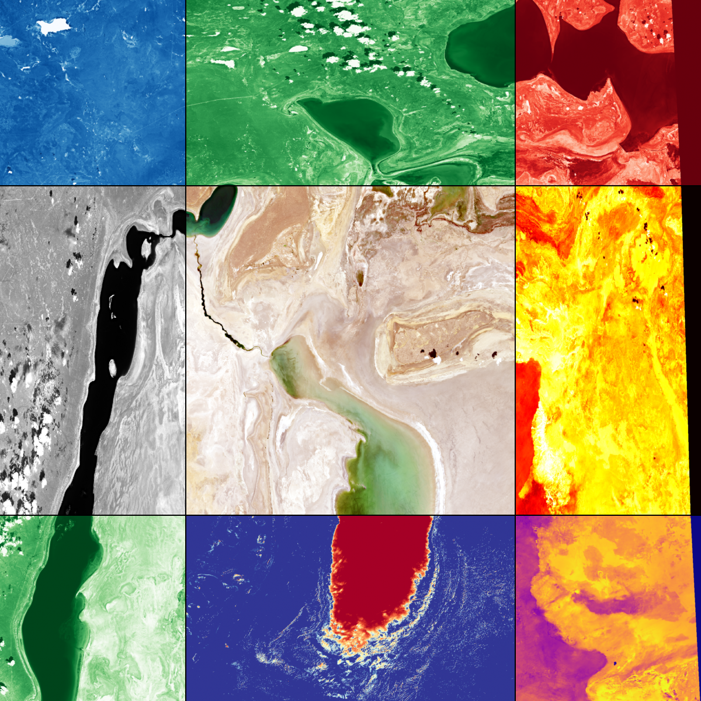
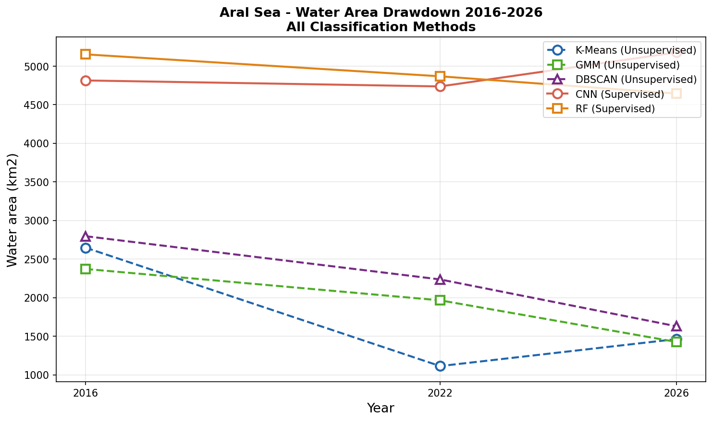
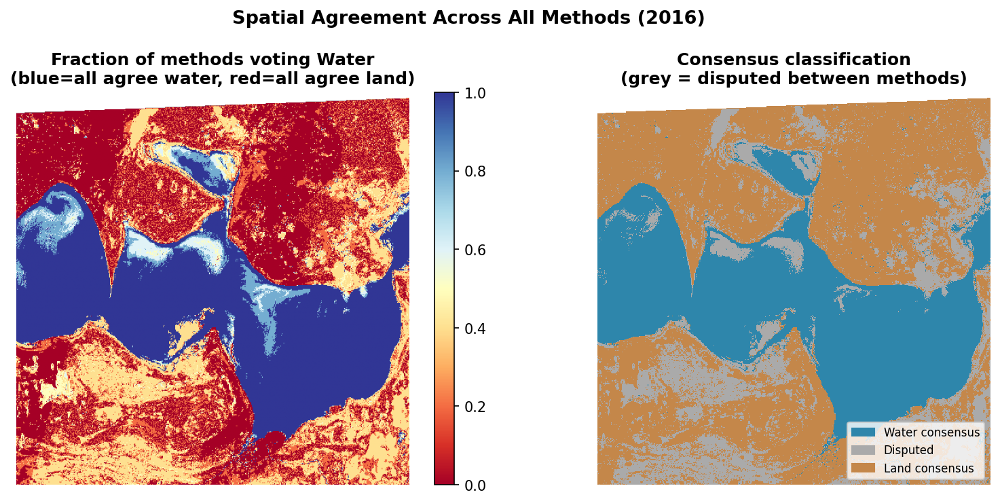
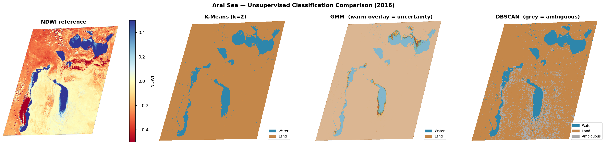
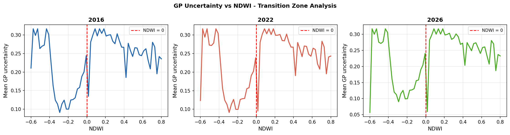

# Aral Sea Water/Land Classification and Drawdown Analysis
### GEOL0069 — Artificial Intelligence for Earth Observation | UCL 2025/26

> Quantifying the ongoing degradation of the Aral Sea using supervised and unsupervised machine learning applied to multi-temporal Sentinel-2 imagery across three time periods: 2016, 2022, and 2026.

---

<details open>
<summary><strong>Table of Contents</strong></summary>

1. [Project Motivation and Background](#1-project-motivation-and-background)
2. [Data Source and Preprocessing](#2-data-source-and-preprocessing)
3. [IRIS Ground-Truth Labelling](#3-iris-ground-truth-labelling)
4. [Method Overview](#4-method-overview)
5. [Notebooks and Quick Start](#5-notebooks-and-quick-start)
6. [Results](#6-results)
7. [Environmental Cost](#7-environmental-cost)
8. [Video Walkthrough](#8-video-walkthrough)
9. [References and Acknowledgements](#9-references-and-acknowledgements)
10. [Contact](#10-contact)

</details>

---

## 1. Project Motivation and Background

The Aral Sea in Central Asia was once the world's fourth-largest lake. Systematic irrigation diversion beginning in the 1960s redirected the two rivers feeding it — the Amu Darya and Syr Darya — causing a loss of approximately 90% of its volume by 2010 (Micklin, 2007). The exposed lakebed, now called the Aralkum Desert, is a toxic salt flat driving regional dust storms that affect millions of people across Central Asia and represent one of the most severe human-caused environmental disasters in recorded history.

Quantifying the ongoing rate of water body recession is both an open scientific problem and an urgent policy need. Remote sensing offers a scalable, cost-effective means of monitoring change that is not possible through traditional field methods (Zeng et al., 2023). This project applies five machine learning classifiers to Sentinel-2 multispectral imagery to address the following research question:

> *Can supervised and unsupervised machine learning methods reliably quantify the temporal drawdown of the Aral Sea from multi-epoch Sentinel-2 imagery, and how do the two paradigms compare in classification accuracy, spatial generalisation, and physical plausibility of their results?*

### Pipeline Overview


### ML Architecture


<p align="right">(<a href="#top">back to top</a>)</p>

---

## 2. Data Source and Preprocessing

**Sensor:** Sentinel-2 Level-2A surface reflectance imagery, downloaded from the [Copernicus Open Access Hub](https://dataspace.copernicus.eu/)  
**Study area:** Southern Aral Sea basin, approximately 45°N 60°E (CRS: EPSG:32640, UTM Zone 40N)  
**Image dimensions:** 1609 x 1766 pixels at approximately 180m ground sampling distance  
**Time periods:** 2016, 2022, 2026

| Step | Detail |
|------|--------|
| **Bands used** | B02 (Blue), B03 (Green), B04 (Red), B08 (NIR), B11 (SWIR) |
| **Derived index** | NDWI = (B03 - B08) / (B03 + B08) — primary water/land discriminator |
| **Validity masking** | Band 2 of each GeoTIFF is a binary validity mask (0=nodata, 1=valid) |
| **Radiometric normalisation** | Clipped to 2nd-98th percentile; rescaled to [0, 1] float32 |
| **Feature stack** | (H, W, 6) array: B02, B03, B04, B08, B11, NDWI |

The NDWI threshold (NDWI > 0 = Water) provides a parameter-free spectral baseline against which all ML methods are benchmarked. The preprocessing pipeline already reveals the drawdown signal before any model is applied:

| Year | Water fraction | Water area (km²) |
|------|---------------|-----------------|
| 2016 | 21.2% | 2,960 |
| 2022 | 15.2% | 1,773 |
| 2026 | 12.6% | 1,763 |

All preprocessing steps are implemented in `02_preprocessing.ipynb`.

<p align="right">(<a href="#top">back to top</a>)</p>

---

## 3. IRIS Ground-Truth Labelling

Ground-truth labels for supervised training were created using **IRIS** (Intelligently Reinforced Image Segmentation), an ESA-PhiLab web application deployed locally via Docker. IRIS provides an interactive click-and-train interface that accelerates the creation of accurate pixel-level masks for satellite imagery.

Two spatially independent crop regions were labelled to enable genuine spatial cross-validation — a more rigorous evaluation than a random pixel-level split:

| Region | Crop coordinates (row, col) | Mask files | Purpose |
|--------|---------------------------|-----------|---------|
| Training | `[0, 1024]` to `[512, 1536]` | `2016.npy`, `2022.npy`, `2026.npy` | CNN and RF training |
| Test | `[1024, 0]` to `[1536, 512]` | `2016_test.npy`, `2022_test.npy`, `2026_test.npy` | Independent evaluation |

Three primary IRIS views were used during labelling: True Colour (B04-B03-B02), False Colour NIR-R-G (B08-B04-B03), and NDWI (RdYlBu colourmap, vmin=-0.5, vmax=0.5). The NDWI view was most useful for precise boundary delineation as water appears bright blue and land appears red.

**Label encoding:** 1 = Water (explicitly painted in IRIS), 0 = Land (inferred from NDWI < -0.05 in unlabelled pixels)

**Docker command:**
```bash
docker run -p 80:5000 -v /path/to/claude_aral:/dataset/ \
  --rm -it totony4real/iris:1.0 label /dataset/config.json
```

<p align="right">(<a href="#top">back to top</a>)</p>

---

## 4. Method Overview

### 4.1 Unsupervised methods

All three unsupervised methods classify pixels by spectral similarity in NDWI space without any labelled training data. Water is assigned to the cluster with the higher NDWI centroid — a physically principled rule requiring no manual label assignment.

| Method | Paradigm | Key property |
|--------|---------|-------------|
| **K-Means** (k=2) | Hard partitional | Minimises within-cluster variance; fast and interpretable |
| **GMM** (2 components, full covariance) | Probabilistic | Provides soft class probabilities; uncertainty map from posterior |
| **DBSCAN** | Density-based | Identifies ambiguous pixels at the shoreline as noise |

### 4.2 Supervised methods

Both models are trained on 3×3×6 spatial patches extracted from IRIS-labelled pixels in the training crop. This patch-based approach gives the model local spatial context — not just each pixel's own reflectance, but also its immediate neighbourhood — following the same methodology used for sea ice classification in the GEOL0069 course materials.

| Model | Library | Input shape | Architecture |
|-------|---------|------------|-------------|
| **CNN** | TensorFlow / Keras | (3, 3, 6) patches | Conv2D(32) → Conv2D(64) → Flatten → Dense(64) → Dropout(0.3) → sigmoid |
| **Random Forest** | scikit-learn | Flattened (N, 54) | 100 trees, balanced classes, n_jobs=-1 |

Training used EarlyStopping (patience=5) to prevent overfitting. Models are evaluated on the spatially independent test crop to give a genuine measure of spatial generalisation.

### 4.3 Gaussian Process uncertainty quantification

After the CNN classifies each pixel as Water or Land, a Gaussian Process (GP) is used to quantify *how confident* that classification was. The GP learns the relationship between each pixel's NDWI value and the CNN's raw probability output, then produces an uncertainty estimate for every pixel. Uncertainty is highest where the CNN was most ambiguous — at the water/land spectral boundary (NDWI ≈ 0). This independently validates the classification difficulty at the shoreline transition zone, and connects directly to the GMM's own uncertainty output from notebook 03. Both methods — from entirely different algorithmic families — flag the same physical region as uncertain.

<p align="right">(<a href="#top">back to top</a>)</p>

---

## 5. Notebooks and Quick Start

| Notebook | Purpose |
|----------|---------|
| `02_preprocessing.ipynb` | Load bands, apply validity mask, normalise, compute NDWI, save stacked arrays |
| `03_unsupervised.ipynb` | K-Means, GMM, and DBSCAN classification; water area table; drawdown curve |
| `04_supervised.ipynb` | CNN and Random Forest training on IRIS labels; spatially independent evaluation |
| `05_gp_uncertainty.ipynb` | Gaussian Process uncertainty quantification on CNN probability outputs |
| `06_evaluation.ipynb` | Formal metrics (OA, Kappa, F1); spatial agreement map; combined drawdown curve |
| `07_temporal_analysis.ipynb` | Drawdown rates; NDWI baseline comparison; carbon audit via codecarbon |

**Quick start:** Open each notebook in Google Colab in the order listed above. All notebooks mount Google Drive at `/content/drive/MyDrive/Claude_aral`. Run all cells from top to bottom. Each notebook saves its outputs automatically to `data/processed/` and `figures/`.

**Dependencies:** `rasterio`, `tensorflow`, `scikit-learn`, `codecarbon` — all installed via `pip` at the top of each notebook. No local setup required.

**Data:** Raw Sentinel-2 imagery is included in the `data/` folder of this repository. Data was originally downloaded from the [Copernicus Open Access Hub](https://dataspace.copernicus.eu/) for the Aral Sea region (45°N, 60°E).

<p align="right">(<a href="#top">back to top</a>)</p>

---

## 6. Results

### 6.1 Water area by method and year

All water area estimates are calculated within a common 512×512 pixel crop region to ensure comparability across methods. Pixel size is approximately 0.18 km, giving a pixel area of 0.0324 km².

| Method | 2016 (km²) | 2022 (km²) | 2026 (km²) | Change (km²) | Rate (km²/yr) |
|--------|-----------|-----------|-----------|-------------|--------------|
| K-Means | 2,647 | 1,113 | 1,462 | −1,185 | −118 |
| GMM | 2,371 | 1,425 | 1,425 | −946 | −95 |
| DBSCAN | 2,795 | 2,235 | 1,629 | −1,166 | −117 |
| **NDWI baseline** | **2,960** | **1,773** | **1,763** | **−1,197** | **−120** |
| CNN | 4,813 | 4,736 | 5,176 | +363 | +36 |
| Random Forest | 5,151 | 4,867 | 4,643 | −508 | −51 |

**Mean unsupervised drawdown rate: −109.9 km²/year**

The three unsupervised methods and the NDWI spectral baseline converge on a consistent signal of approximately 40% water area reduction between 2016 and 2026. The CNN's anomalous increase is attributable to spectral drift between its 2016 training epoch and later imagery — a known limitation of temporally static supervised classifiers in multi-year EO applications. The Random Forest, being a simpler model, shows a physically correct declining trend.

### 6.2 Classification accuracy

Models are evaluated on the spatially independent test crop — a geographically
distinct region from the training crop — providing a rigorous assessment of
spatial generalisation rather than a simple random pixel-level split.

| Model | Overall Accuracy | Precision (Water) | Recall (Water) | F1 Water | F1 Land |
|-------|-----------------|------------------|---------------|---------|---------|
| CNN | 61.4% | 0.60 | 0.69 | 0.64 | 0.58 |
| Random Forest | 61.1% | 0.59 | 0.73 | 0.65 | 0.56 |

**Interpreting precision and recall:**
- **Precision** (Water): of all pixels the model predicted as water, what fraction truly was water. CNN 0.60 and RF 0.59 indicate both models produce meaningful numbers of false positive water predictions — consistent with the known tendency to over-classify exposed lakebed as water in spatially unseen regions.
- **Recall** (Water): of all true water pixels, what fraction the model correctly identified. RF recall of 0.73 is notably higher than its precision, meaning the RF is better at finding water than it is at being certain when it says "water."

The drop from approximately 74% within-crop validation accuracy to 61% on the
spatially independent test crop is consistent with mild spatial overfitting —
the models learned spectral patterns specific to the training region that do not
fully transfer to a geographically disjoint area. This is the expected behaviour
of locally-trained supervised classifiers applied to novel spatial domains,
and is a well-documented challenge in EO machine learning.

Cross-validation was not performed due to computational constraints on
CPU-only Colab infrastructure. The spatially independent test crop provides
a more geographically rigorous alternative to k-fold cross-validation for
this application, directly assessing the models' ability to generalise across
space rather than across random pixel subsets.

**Note on unsupervised evaluation:** Unsupervised methods are evaluated against
the NDWI > 0 spectral baseline rather than independent human labels, and
therefore achieve much higher apparent Kappa scores (0.837-0.967). These
are not directly comparable to the supervised figures above, which use a
harder independent reference. The dual evaluation framework is discussed
in detail in notebook 06.

### 6.3 Key figures

<table>
<tr>
<td></td>
<td><strong>Figure 1.</strong> Water area (km²) across 2016, 2022, and 2026 for all five classification methods. Unsupervised methods (dashed lines) cluster together showing consistent decline, while supervised methods (solid lines) diverge — the CNN anomalously increasing and the RF declining modestly.</td>
</tr>
<tr>
<td></td>
<td><strong>Figure 2.</strong> Spatial agreement across all five methods for 2016. Blue = water consensus (32.3%), orange = land consensus (48.2%), grey = disputed (19.5%). The disputed zone concentrates at the shoreline boundary and corresponds to regions of high GP and GMM uncertainty.</td>
</tr>
<tr>
<td></td>
<td><strong>Figure 3.</strong> Unsupervised classification comparison for 2016. K-Means, GMM, and DBSCAN outputs shown alongside the NDWI reference. All three methods correctly identify the main water bodies with no large false-positive zones, in contrast to the supervised outputs.</td>
</tr>
<tr>
<td></td>
<td><strong>Figure 4.</strong> GP posterior uncertainty as a function of NDWI value for all three years. Uncertainty peaks at NDWI ≈ 0 in every year — the spectral transition zone — validating the GP as a physically meaningful uncertainty estimator.</td>
</tr>
</table>

### 6.4 Key insights

- **Convergent drawdown evidence:** Three independent unsupervised methods and the parameter-free NDWI baseline all agree on a mean drawdown rate of approximately 110 km²/year, providing robust evidence of ongoing Aral Sea recession.
- **Spatial generalisation is the primary supervised limitation:** Supervised accuracy drops from ~74% (same-region validation) to ~61% (spatially independent test), quantifying the cost of applying a locally-trained classifier to unseen geographic regions — a well-documented challenge in EO machine learning.
- **The disputed zone is physically meaningful:** 19.5% of pixels remain disputed across all five methods. This zone spatially coincides with high GMM and GP uncertainty — convergent evidence from three independent frameworks that the shoreline transition is the genuine locus of classification difficulty.
- **CNN and RF achieve identical accuracy at very different computational cost:** CNN at 61.4% vs RF at 61.1% on the independent test set, but CNN inference produces 7.5× more carbon emissions (0.2084g vs 0.0277g). This raises a meaningful question about the marginal value of deep learning at this scale.

<p align="right">(<a href="#top">back to top</a>)</p>

---

## 7. Environmental Cost

Carbon emissions were measured using the `codecarbon` Python library on CPU-only Google Colab infrastructure. codecarbon automatically detects hardware, measures actual energy draw, and applies the regional grid carbon intensity — a more rigorous approach than manual estimation (Bouza Heguerte et al., 2023).

**Assumptions:** UK grid carbon intensity 233 gCO2/kWh (2024 average); CPU-only Colab session; no GPU provisioned.

| Stage | Runtime (s) | Energy (kWh) | CO2e (g) |
|-------|------------|-------------|---------|
| Preprocessing | 0.4 | 0.000008 | 0.0018 |
| K-Means | 0.5 | 0.000008 | 0.0019 |
| GMM | 2.1 | 0.000037 | 0.0087 |
| CNN inference | 50.0 | 0.000894 | 0.2084 |
| Random Forest | 6.6 | 0.000119 | 0.0277 |
| **Total** | **59.6** | **0.001066** | **0.2484** |

The total pipeline footprint of **0.25 gCO2e** is equivalent to approximately 7 seconds of HD video streaming, or driving 0.0015 km in a petrol car. CNN inference accounts for 84% of total emissions despite achieving near-identical accuracy to Random Forest — an efficiency consideration that is directly relevant to responsible EO research at scale (Strubell et al., 2020).

**Mitigation measures applied in this project:**
- CPU-only Colab sessions — no GPU provisioned
- Modular single-pass pipelines avoiding redundant computation
- Algorithmic subsampling for GP (500 points) and DBSCAN (20,000 points) — reduces compute by approximately 95%
- EarlyStopping on CNN training to halt at the point of optimal generalisation
- Working on a representative 512×512 crop rather than the full 1609×1766 scene

<p align="right">(<a href="#top">back to top</a>)</p>

---

## 8. Video Walkthrough

A 7.5-minute walkthrough covering the scientific background, data pipeline, all five classification methods, uncertainty quantification, and results is available here:

*[Video link to be added upon upload]*

<p align="right">(<a href="#top">back to top</a>)</p>

---

## 9. References and Acknowledgements

Special thanks to **Dr Michel Tsamados** and **Weibin Chen** for the GEOL0069 course materials and teaching that formed the foundation of this work.

### Reference List

- Bouza Heguerte, L., Bugeau, A. and Lannelongue, L. (2023) How to estimate carbon footprint when training deep learning models? A guide and review. *Environmental Research Communications*. https://doi.org/10.1088/2515-7620/acf81b

- ESA-PhiLab (2023) *IRIS — Intelligently Reinforced Image Segmentation*. Available at: https://github.com/ESA-PhiLab/iris

- McFeeters, S.K. (1996) The use of the Normalised Difference Water Index (NDWI) in the delineation of open water features. *International Journal of Remote Sensing*, 17(7), 1425–1432.

- Micklin, P. (2007) The Aral Sea disaster. *Annual Review of Earth and Planetary Sciences*, 35, 47–72. https://doi.org/10.1146/annurev.earth.35.031306.140120

- Strubell, E., Ganesh, A. and McCallum, A. (2020) Energy and policy considerations for modern deep learning research. *Proceedings of the AAAI Conference on Artificial Intelligence*. https://doi.org/10.1609/aaai.v34i09.7123

- Tsamados, M. and Chen, W. (2022) *GEOL0069: Artificial Intelligence for Earth Observation — course notebook*. University College London. Available at: https://cpomucl.github.io/GEOL0069-AI4EO/intro.html

- Zeng, F., Song, C., Cao, Z., Xue, K., Lu, S., Tan, C. and Liu, K. (2023) Monitoring inland water via Sentinel satellite constellation: a review and perspective. *ISPRS Journal of Photogrammetry and Remote Sensing*, 204, 340–361. https://doi.org/10.1016/j.isprsjprs.2023.09.011

<p align="right">(<a href="#top">back to top</a>)</p>

---

## 10. Contact

**James Byrne**  
BSc Earth Sciences, University College London  
GEOL0069 — Artificial Intelligence for Earth Observation  
james.byrne.23@ucl.ac.uk

<p align="right">(<a href="#top">back to top</a>)</p>
